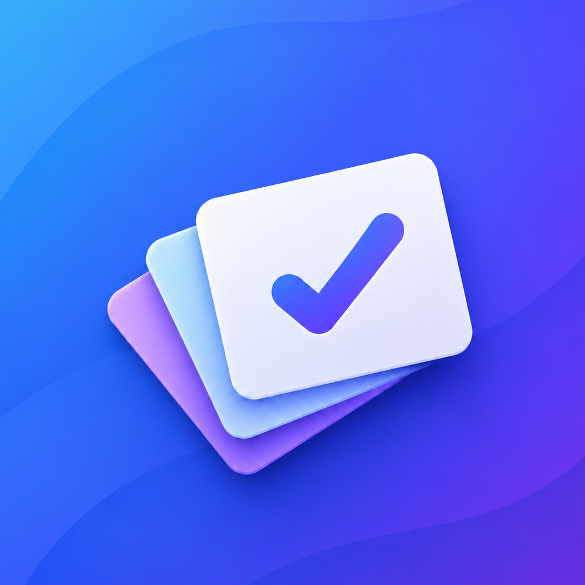
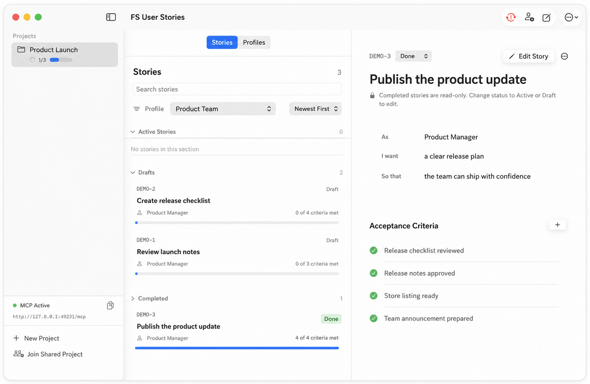

# FS User Stories

<p align="center">
  
</p>

<h3 align="center">Fast &amp; Simple User Stories</h3>

<p align="center">
  Your stories, on your computer. Share with Git. Nothing else.
</p>

<p align="center">
  <a href="https://gitlares.github.io/fs-user-stories/">Website</a> ·
  <a href="https://apps.apple.com/app/id6801671870">Mac App Store</a> ·
  <a href="https://www.paypal.com/donate/?hosted_button_id=7RDCBR3QXXEMJ">♥ Support</a> ·
  <a href="https://github.com/gitlares/fs-user-stories/issues">Issues</a> ·
  <a href="./LICENSE">MIT License</a>
</p>

FS User Stories is a local-first application for writing clear requirements
without turning them into a project-management system. The native macOS app and
the Qt app for Windows and Linux share the same Rust core and project format. It
keeps the product deliberately small: projects, profiles, stories, acceptance
criteria, one notes field, and attachments.



## Why this exists

FS User Stories began with a practical need: a couple maintaining several
projects together. One person writes code; the other understands the product,
what should be built, and why. They often only need a clear, shared place to
write down a feature so it can be implemented. The same shape appears in any
small team where one person builds and another owns the product.

Tools such as Jira, Asana, and Trello can be excellent when their process is
needed, but for this workflow they can add accounts, setup, ceremony, cost, and
more surface area than the work requires. The same friction appears with many
hosted MCP integrations: access can be paid or limited, the round trip can be
slow, and large tool responses consume unnecessary agent context.

The stories stay on the computer, collaboration is optional through a
repository the team already controls, and the local MCP server gives any
compatible agent a small, direct interface to the same data.

There are no FS User Stories accounts, no telemetry, no required cloud, no
subscriptions, no sprints, no estimates, no assignees, no deadlines, and no
dashboards. The app works offline, exposes a local MCP server for compatible
agents, and uses Git only when the user chooses to share a project.

> FS User Stories does not manage your team, your dates, or your company. It only
> makes clear what needs to be built.

## Version 1.0.8 (Build 9)

FS User Stories is a functional product, not a static UI
prototype. It includes a signed and notarized Apple Silicon application with the
following capabilities.

### Native macOS experience

- SwiftUI interface designed around current macOS patterns and system materials.
- English and Spanish localization, selected from the user's system language.
- Large-window startup, standard keyboard commands, list navigation, contextual
  actions, and menu-bar access.
- A menu-bar companion that keeps projects and active stories accessible when the
  main window is closed, with a separate command to quit completely.
- Native confirmation dialogs for destructive operations.
- Search, collapsible Draft, Active, and Completed sections, status filtering,
  profile filtering, and newest/oldest/title ordering.
- A first-run choice to create a project, use an invitation, or connect an
  existing shared repository.

### Projects, profiles, and stories

- Create and manage multiple local projects.
- Create, edit, search, and delete project profiles.
- Create, edit, duplicate, search, filter, and delete user stories.
- The focused user-story format: **As a**, **I want**, and **So that**.
- Exactly three states: **Draft**, **Active**, and **Completed**.
- Completed stories are read-only until they are reopened as Active or Draft.
- Checkable acceptance criteria with add, edit, and remove actions.
- Visual completion progress as completed criteria over total criteria.
- A direct **Mark as Completed** action once every criterion is satisfied.
- One intentionally simple notes field per story—no comment threads or activity
  feed.
- Export all, Active, Completed, Draft, or manually selected stories into one
  readable Markdown file; review and import selected stories from the same open
  format. Attachments are intentionally excluded from this transfer format.

### Managed attachments

- Add files with the file picker or drag and drop.
- Preview supported files with native macOS Quick Look.
- Files are copied into managed application storage, so moving the original does
  not break the story.
- Up to 10 attachments per story, 10 MB per file, and 50 MB total per story.
- Attachment metadata and SHA-256 hashes travel with the portable project data.

### Local persistence

- Projects, profiles, stories, criteria, notes, and attachment metadata persist
  in a local SQLite database.
- Attachment contents remain in the app's managed Application Support directory.
- The application works fully without an Internet connection.
- UI and MCP operations use the same application layer and persistence rules, so
  data is not duplicated across separate implementations.
- Changes made through MCP notify the application and refresh the visible state.

### Local MCP for any compatible agent

The app runs a loopback-only MCP server while it is open. The MCP screen shows
the live status, URL, port, and connection instructions; the same status is also
visible in the app footer and menu bar.

Version 1.0.8 exposes 27 tools covering the product's real operations:

- Describe the application and list or inspect projects.
- Create projects and inspect repository status.
- List, create, edit, and delete profiles.
- Search and filter stories; read complete story details.
- Create, edit, duplicate, delete, and change the status of stories.
- Add, update, complete, and remove acceptance criteria.
- Update the single notes field.
- List, add, resolve, and delete managed attachments.
- Connect and synchronize shared repositories and create invitations.

Destructive MCP calls require explicit confirmation. Completed stories remain
read-only through MCP just as they do in the UI. The server also includes a
prompt that helps an agent inspect an existing codebase and propose profiles and
user stories for the selected project.

The server binds only to the local loopback interface. FS User Stories operates
no proxy, account service, or remote MCP infrastructure, and receives none of the
user's project data.

### Optional Git synchronization

Every project receives a private managed repository inside the app's Application
Support directory. Users interact with simple product actions—connect, create,
share, join, and synchronize—rather than with commits or branches.

- A remote is optional and may be hosted by GitHub, GitLab, or another compatible
  Git host.
- The app can connect an existing remote or create a private GitHub repository
  after browser-based Device Flow authorization.
- The GitHub OAuth token is stored in macOS Keychain when available. Development
  runs without Keychain entitlement keep it only in memory for that session. It
  is never written to SQLite, project JSON, invitations, logs, or Git.
- Repository owners can invite a GitHub collaborator by username from the app.
  A new Mac authorizes its own GitHub account automatically while joining a
  private GitHub project.
- SSH remotes use the user's existing local SSH agent. Public HTTPS remotes work
  without credentials.
- Share invitations contain the project identity and remote URL, never account
  credentials.
- Changes to separate stories or profiles merge automatically. Concurrent changes
  to the same item ask the user to choose **Keep Mine** or **Use Shared**.
- Every story has an immutable UUID identity. Human references such as `NUB-4`
  remain readable labels; if two Macs create the same number concurrently, both
  stories survive and the duplicate references are renumbered deterministically.
- Shared projects synchronize in the background with a visible per-project
  status. The active project refreshes more often, local edits use bounded
  debounce, and inactive projects are checked less frequently.
- The app never places the SQLite database in Git.

FS User Stories reserves the isolated `fs-user-stories` branch in every remote.
It never fetches, checks out, merges, pushes, force-pushes, or deletes `main`,
`master`, or another code branch. This keeps an existing source repository safe,
although a dedicated repository remains the clearest choice for a team.

## Install

The native macOS edition is distributed through the
[Mac App Store](https://apps.apple.com/app/id6801671870). Linux x64 is available
as a [Snap](https://snapcraft.io/fs-user-stories) or a portable
[AppImage](https://github.com/gitlares/fs-user-stories/releases/download/v1.0.8/FSUserStories-1.0.8-x86_64.AppImage).
Windows remains a source-build and contributor-testing target.

> **Windows and Linux still need contributors.** Linux 1.0.8 is now packaged
> and has passed clean Ubuntu 22.04 dependency, launch, core, and MCP checks.
> Windows is continuously compiled and smoke-tested, but we do not yet consider
> either Qt edition as mature as the native macOS edition. We welcome complete
> workflow testing, reproducible reports, and fixes through
> [GitHub Issues](https://github.com/gitlares/fs-user-stories/issues).

Back up important project data and
[report unexpected behavior](https://github.com/gitlares/fs-user-stories/issues).

## Version 1 is available

FS User Stories has passed its original Version 1 milestone. Version 1.0.8 is
the current code release and includes the complete local-first workflow, Git
sharing and automatic synchronization, portable attachments, and the local MCP
server across the shared Rust core and platform interfaces.

### Platform status

- **macOS:** the production edition is distributed through the Mac App Store.
  It provides the complete native experience and is the reference edition.
- **Windows x64:** the Qt edition compiles in GitHub Actions, produces a single
  installer, and passes an automated installation smoke test. It is available
  for source builds and contributor testing, but is not yet considered ready
  for general distribution.
- **Linux x64:** version 1.0.8 is available from the Snap Store and as an
  AppImage. Both packages include the Qt runtime and Rust core and were tested
  on Magnolia; the AppImage was additionally verified on clean Ubuntu 22.04.
  Broader real-world testing is welcome.

The product promise is the same on every platform: local data, no FS User
Stories account, no mandatory cloud, optional Git sharing, automatic repository
repair and synchronization, portable attachments, and a local MCP server for
the agent the user chooses. Windows and Linux contributors are welcome to help
test complete workflows, improve packaging, and report reproducible issues.

### Test with two Macs

1. On the first Mac, open **Share & Sync** and choose **Create on GitHub**.
2. Enter the second person's GitHub username under **Invite a GitHub collaborator**.
3. The collaborator accepts GitHub's repository invitation.
4. On the first Mac, choose **Copy Invitation** or **Share Invitation…**.
5. On the second Mac, choose **Join Shared Project** and paste the invitation.
6. Authorize GitHub when the app opens Device Flow. No token is included in the
   invitation.
7. Make a change on either Mac and watch the synchronization indicator. Use
   **Synchronize Now** only when an immediate manual refresh is useful.

## Portable project format

SQLite is the local source of truth. Git synchronization exports an open,
reviewable archive instead of copying the database:

```text
.fs-user-stories/
├── project.json
├── README.md
├── profiles/
│   └── <profile-id>.json
├── stories/
│   └── <story-id>.json
└── attachments/
    └── <story-id>/<managed-files>
```

The project header and one JSON file per profile and story form the synchronized
source of truth. This keeps diffs focused, conflicts small, and the data directly
readable by language models. A generated README summarizes the project for people.
Attachments are copied, size-limited, and verified by hash.

## Architecture

The codebase separates the portable product core from the native macOS shell:

- `Sources/FSUserStoriesApp/App`: application entry point and macOS lifecycle.
- `Sources/FSUserStoriesApp/Application`: observable UI state and command
  coordination through the Rust protocol.
- `Sources/FSUserStoriesApp/Domain`: Codable view models exchanged with Rust.
- `Sources/FSUserStoriesApp/Infrastructure`: thin macOS adapters for Keychain,
  security-scoped files, process execution, and system storage locations.
- `Sources/FSUserStoriesApp/UI`: SwiftUI views, components, localization, and
  native macOS presentation.
- `Sources/FSUserStoriesApp/MCP`: lifecycle adapter for the bundled Rust MCP
  process.
- `Sources/FSUserStoriesApp/Infrastructure/Git`: Rust command bridge, macOS
  background timers, and Keychain token storage.
- `Core`: authoritative Rust business rules, SQLite persistence, search,
  Markdown transfer, managed attachments, Git/GitHub synchronization,
  invitations, conflict handling, scheduling policy, and MCP server/tools.

The Rust core is compiled from the source under `Core` and bundled into the app
as a self-contained executable. There is one SQLite database and no alternate
Swift backend. Rust is the portable basis for future platforms while the current
user interface remains fully native to macOS.

## Build from source

Source builds are available for macOS, Windows x64, and Linux x64. They do not
need an Apple Developer account, GitHub token, or FS User Stories account. The
Linux AppImage is attached to the v1.0.8 GitHub Release; Windows binaries remain
limited to CI artifacts and collaborator testing, while macOS is distributed
through the Mac App Store.

### macOS (Apple Silicon)

Requires macOS 26 or later, Xcode 26 or newer, Rust 1.97 or newer, CMake, and
Git. After installing those tools, build with:

```sh
./Scripts/build-and-run-local.sh --no-open
```

Use `./Scripts/build-and-run-local.sh --test` to run the macOS and Rust tests.

### Linux x64

On Ubuntu/Debian, install the build prerequisites once:

```sh
sudo apt install build-essential cmake ninja-build pkg-config git libsecret-1-dev
rustup toolchain install stable
```

Install a Qt 6.5 or newer desktop kit (Qt 6.7.3 `gcc_64` is the tested kit).
Ubuntu 24.04's repository contains Qt 6.4, which is too old for this source.
When Qt is not in CMake's search path, point the build script to the kit:

```sh
export FS_USER_STORIES_QT_ROOT="$HOME/Qt/6.7.3/gcc_64"
```

Then create a local AppImage with one command:

```sh
./Scripts/build-linux-app.sh
```

The script builds the Rust core and Qt app. It requires `linuxdeploy` and its
Qt plugin only for the final AppImage wrapper; see `docs/qt-build-linux.md` for
their installation. For an unwrapped local executable, run
`./Scripts/build-core-linux.sh`, then CMake against `Platform/Qt`.

### Windows x64

Install once: Visual Studio 2022 Build Tools with **Desktop development with
C++**, Rust, CMake, Ninja, NSIS, and Qt 6.7.3 `msvc2019_64`. Then, from PowerShell:

```powershell
.\Scripts\build-windows-local.ps1
```

If Qt is not in CMake's search path, set its kit directory first:

```powershell
$env:FS_USER_STORIES_QT_ROOT = 'C:\Qt\6.7.3\msvc2019_64'
.\Scripts\build-windows-local.ps1
```

This creates a local x64 installer under `Distribution\Windows`. Use
`-SkipInstaller` to compile only the app.

### Requirements

- Xcode 26 or newer.
- Rust 1.97 or newer.
- CMake, used only to compile the vendored libgit2 dependency.
- Git, for cloning the source and optional project synchronization.

Install Xcode from the Mac App Store, open it once to finish installing its
components, and make it the active developer directory if necessary:

```sh
sudo xcode-select --switch /Applications/Xcode.app/Contents/Developer
xcodebuild -version
```

Install Rust with the official [rustup](https://rustup.rs/) installer. Install
CMake with [Homebrew](https://brew.sh/) or another trusted package manager:

```sh
brew install cmake
rustc --version
cargo --version
cmake --version
```

### One-command local build

Clone the repository and run the local build helper:

```sh
git clone https://github.com/gitlares/fs-user-stories.git
cd fs-user-stories
./Scripts/build-and-run-local.sh
```

The script validates the Mac and toolchain, compiles the Rust core from `Core`,
creates an unsigned local application and DMG under `Distribution`, and opens the
app. Use `--no-open` to build without launching or `--test` to run both suites:

```sh
./Scripts/build-and-run-local.sh --no-open
./Scripts/build-and-run-local.sh --test
```

The first build takes longer because Cargo compiles vendored libgit2 and OpenSSL
from their locked source dependencies. Later builds reuse the local build cache.
The resulting app is intended for use on the Mac that built it; share the official
signed and notarized DMG with testers instead of redistributing this unsigned
build.

No precompiled FS User Stories executable is stored in the repository. The
generated Rust core, Swift build products, application bundle, and DMG are all
ignored by Git. `Core/Cargo.lock` pins the complete Rust dependency graph so the
source used by Cargo can be reviewed and reproduced.

### Build transparency

The application source, Rust core, build scripts, package metadata, OAuth client
identifier, schemas, migrations, and dependency lockfile are public. The GitHub
OAuth client identifier is intentionally included because Device Flow client IDs
identify an application; they are not passwords or access tokens. Every user
authorizes their own GitHub account, and credentials are never committed.

Official downloads add a Developer ID signature and an Apple notarization ticket
to the application built by these scripts. The release owner's private signing
key is the only release input that cannot be public. Anyone can independently
build the unsigned application and inspect an official download with:

```sh
codesign --verify --deep --strict --verbose=2 "/Applications/FS User Stories.app"
spctl --assess --type execute --verbose=4 "/Applications/FS User Stories.app"
```

Release notes publish a SHA-256 checksum for the DMG so testers can verify the
downloaded artifact with `shasum -a 256`.

### Manual build

Build the Rust core and then the macOS application:

```sh
./Scripts/build-core.sh
DEVELOPER_DIR=/Applications/Xcode.app/Contents/Developer swift build
```

Run the test suites:

```sh
DEVELOPER_DIR=/Applications/Xcode.app/Contents/Developer swift test
cargo test --manifest-path Core/Cargo.toml
```

Create an unsigned local application and DMG:

```sh
./Scripts/package-release.sh
```

Local data is stored in:

```text
~/Library/Application Support/FS User Stories/
```

Removing the repository checkout does not remove that local application data.
Do not delete the Application Support directory unless you intentionally want to
remove every locally stored project and managed attachment.

Signing and notarization are release-owner actions performed separately with
`Scripts/sign-and-notarize-release.sh`. See
[`docs/releasing-macos.md`](./docs/releasing-macos.md) for the release
checklist.

## Product principles

- No telemetry.
- No FS User Stories accounts.
- No FS User Stories servers.
- No subscriptions.
- No required cloud.
- No sprints, estimates, assignees, deadlines, or dashboards.
- No built-in AI provider.
- Local MCP for the tools the user chooses.
- Optional Git for sharing through infrastructure the user controls.
- Open and portable data.
- Dependencies compatible with commercial redistribution.

## Project language

English is the default language for source code, documentation, issues, and pull
requests. The application follows the user's system language and currently ships
in English and Spanish.

## License

FS User Stories is distributed under the [MIT License](./LICENSE). It permits
free and paid distributions, including a future commercial iOS edition. See
[`THIRD_PARTY_NOTICES.md`](./THIRD_PARTY_NOTICES.md) for bundled dependency
licenses.
